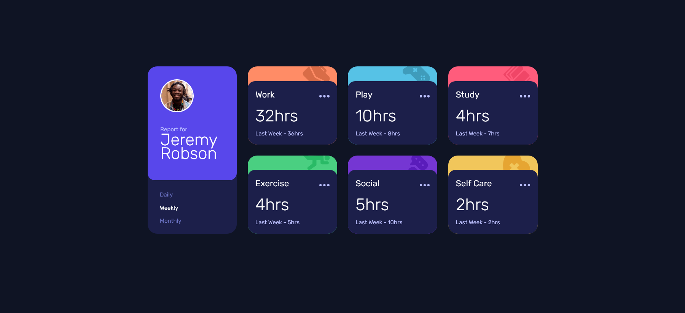

# Frontend Mentor - Time tracking dashboard solution

This is a solution to the [Time tracking dashboard challenge on Frontend Mentor](https://www.frontendmentor.io/challenges/time-tracking-dashboard-UIQ7167Jw).

## Table of contents

- [Overview](#overview)
  - [The challenge](#the-challenge)
  - [Screenshot](#screenshot)
  - [Links](#links)
- [My process](#my-process)
  - [Built with](#built-with)
  - [What I learned](#what-i-learned)
  - [Useful resources](#useful-resources)
- [Author](#author)


## Overview

### The challenge

Users should be able to:

- View the optimal layout for the site depending on their device's screen size
- See hover states for all interactive elements on the page
- Switch between viewing Daily, Weekly, and Monthly stats

### Screenshot




### Links

- Solution URL: [Add solution URL here](https://github.com/uvdevelop26/time-tracking-dashboard-main)
- Live Site URL: [Add live site URL here](https://your-live-site-url.com)

## My process

### Built with

- Semantic HTML5 markup
- CSS custom properties
- Flexbox
- CSS Grid
- Mobile-first workflow
- [Vue.js](https://vuejs.org/guide/introduction.html) - JS library


### What I learned

returning computed property to watch for changes:
```js
const active = computed(() => {
    const currentActive = activeStates.find(element => element.state === true)

    return currentActive
})
```

### Useful resources

- [Example resource 1](https://lenguajejs.com/vuejs/componentes/reactividad-api/) - this helped me to differentiate between ref and reactive

## Author

- Frontend Mentor - [@uvdevelop26](https://www.frontendmentor.io/profile/uvdevelop26)


